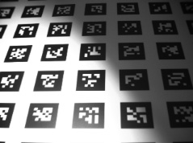
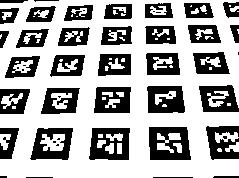

go-derek
======================================================================

Implementation of Derek Bradley's "Adaptive Thresholding using the Integral Image" in Golang.

https://people.scs.carleton.ca/~roth/iit-publications-iti/docs/gerh-50002.pdf

example
----------------------------------------------------------------------

### Original

### Filtered

