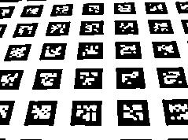

derekify
======================================================================

Command derekify is a sample program to process a image using Derek Bradley's "Adaptive Thresholding using the Integral Image".

```
Usage of derekify:
  -cluster int
        cluster size (default 100)
  -format string
        output format jpg or png (default "jpg")
  -in string
        input filename (use stdin if empty)
  -out string
        output filename (use stdout if empty)
  -threshold int
        threshold [0, 100] (default 85)
```


example
----------------------------------------------------------------------

```
derekify -in sample.in.jpg -out sample.out.jpg -cluster 8 -threshold 90
```

### Original


### Filtered


